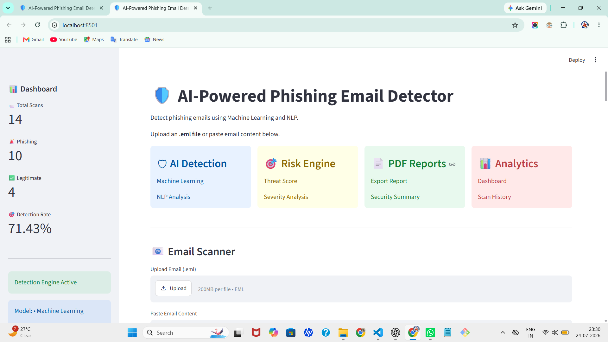
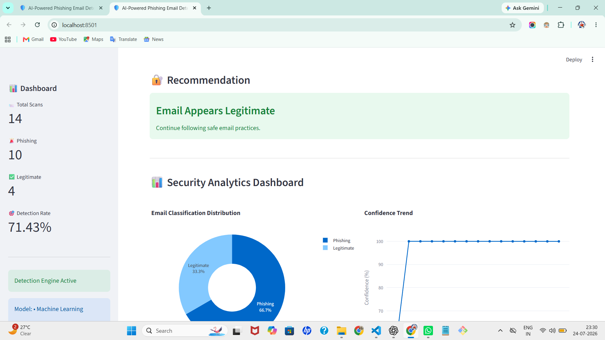

# 🛡️ AI-Powered Phishing Email Detector


An AI-powered cybersecurity application that detects phishing emails using **Machine Learning (ML)** and **Natural Language Processing (NLP)**. The system analyzes emails, detects phishing indicators, calculates risk scores, classifies attacks, generates downloadable PDF security reports, and visualizes security analytics through an interactive Streamlit dashboard.

---

# 🚀 Live Demo

**Coming Soon**

*(After deployment, replace this section with your Streamlit Cloud URL.)*

---

# 📖 Project Overview

Phishing attacks are one of the most common cybersecurity threats used to steal sensitive information such as usernames, passwords, banking credentials, and personal data.

This project provides an intelligent phishing detection platform capable of:

- Detecting phishing emails using Machine Learning
- Identifying suspicious keywords and URLs
- Performing NLP-based email analysis
- Calculating a security risk score
- Classifying phishing attack types
- Assessing attack severity
- Generating professional PDF security reports
- Visualizing security analytics

---

# ✨ Features

- 🤖 Machine Learning-based Email Classification
- 🧠 Natural Language Processing (NLP)
- 📧 Upload and Analyze `.eml` Files
- 📝 Analyze Email Text
- 🚨 Suspicious Keyword Detection
- 🔗 URL Detection
- 🛡️ Risk Scoring Engine
- 🎯 Attack Classification
- 🚨 Severity Assessment
- 📄 PDF Security Report Generation
- 📊 Interactive Analytics Dashboard
- 📜 Scan History
- 📧 Email Header Analysis
- 📈 Confidence Score Visualization

---

# 🖼️ Application Screenshots

## 🏠 Dashboard



---

# 🚨 Phishing Email Detection

## Step 1 – Threat Indicators & Threat Assessment


---

## Step 2 – AI Security Explanation & Attack Classification


---

## Step 3 – Security Report & Recommendation


---

# ✅ Legitimate Email Detection


---

# 📊 Security Analytics Dashboard



---

# 📄 Generated PDF Security Report


---

# 🏗️ System Architecture

```text
                     User
                      │
                      ▼
        Upload Email / Paste Email
                      │
                      ▼
              Email Parser (.eml)
                      │
                      ▼
          NLP Feature Extraction
                      │
                      ▼
      Machine Learning Classification
                      │
      ┌───────────────┼───────────────┐
      ▼               ▼               ▼
Threat Engine    Risk Engine    Header Analysis
      ▼               ▼               ▼
      └───────────────┼───────────────┘
                      ▼
         AI Security Explanation
                      ▼
      Severity Assessment & Attack Classification
                      ▼
       PDF Security Report + Analytics Dashboard
```

---

# 🛠️ Technology Stack

| Category | Technology |
|-----------|------------|
| Programming Language | Python |
| Machine Learning | Scikit-learn |
| Frontend | Streamlit |
| Data Processing | Pandas |
| Data Visualization | Plotly |
| PDF Generation | ReportLab |
| Model Storage | Joblib |

---

# 📂 Project Structure

```text
AI-Phishing-Email-Detector/
│
├── screenshots/
│   ├── dashboard.png
│   ├── phishing-1.png
│   ├── phishing-2.png
│   ├── phishing-3.png
│   ├── legitimate.png
│   ├── analytics.png
│   └── security-report.png
│
├── data/
├── history/
├── models/
├── src/
│   ├── app.py
│   ├── analyzer.py
│   ├── attack_classifier.py
│   ├── explanation_engine.py
│   ├── header_analyzer.py
│   ├── pdf_report.py
│   ├── risk_engine.py
│   ├── scan_history.py
│   ├── severity_engine.py
│
├── README.md
├── requirements.txt
└── LICENSE
```

---

# ⚙️ Installation

Clone the repository:

```bash
git clone https://github.com/ankitachinchole/AI-Phishing-Email-Detector.git
```

Navigate into the project:

```bash
cd AI-Phishing-Email-Detector
```

Create a virtual environment:

```bash
python -m venv .venv
```

Activate the virtual environment (Windows):

```bash
.venv\Scripts\activate
```

Install dependencies:

```bash
pip install -r requirements.txt
```

Run the application:

```bash
streamlit run src/app.py
```

---

# 🚀 Workflow

1. User uploads an email or pastes email content.
2. Email content is parsed and preprocessed.
3. NLP extracts relevant features.
4. Machine Learning model predicts phishing or legitimate.
5. Suspicious indicators are identified.
6. Risk score is calculated.
7. Attack type is classified.
8. Severity level is assessed.
9. AI explanation is generated.
10. PDF report is created.
11. Scan history and analytics are updated.

---

# 📈 Future Enhancements

- VirusTotal API Integration
- WHOIS Domain Lookup
- URL Reputation Analysis
- QR Code Phishing Detection
- Attachment Malware Scanning
- Real-Time Threat Intelligence
- Deep Learning Models
- Multi-language Email Detection
- Cloud Deployment
- LLM-powered Threat Explanation

---

# 🎯 Skills Demonstrated

- Machine Learning
- Natural Language Processing (NLP)
- Cybersecurity
- Email Security
- Threat Detection
- Risk Analysis
- Python Development
- Streamlit Application Development
- Data Visualization
- PDF Report Generation

---

# 👩‍💻 Author

## Ankita Chinchole

**Cybersecurity & Blockchain Technology Student**

Interested in:

- 🔐 Cybersecurity
- 🤖 Artificial Intelligence
- 🧠 Machine Learning
- 🛡️ Threat Detection
- 💻 Secure Software Development

---

# 📜 License

This project is licensed under the MIT License.

---

# ⭐ Support

If you found this project useful, consider giving it a ⭐ on GitHub.