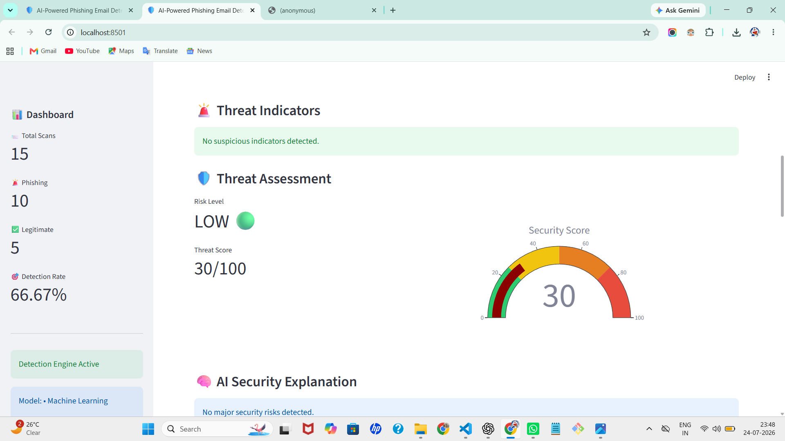
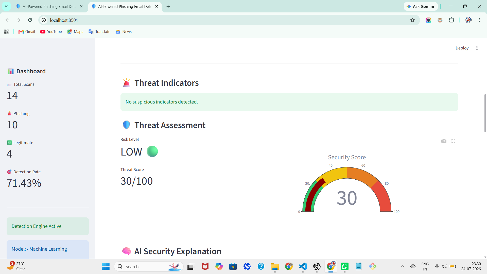
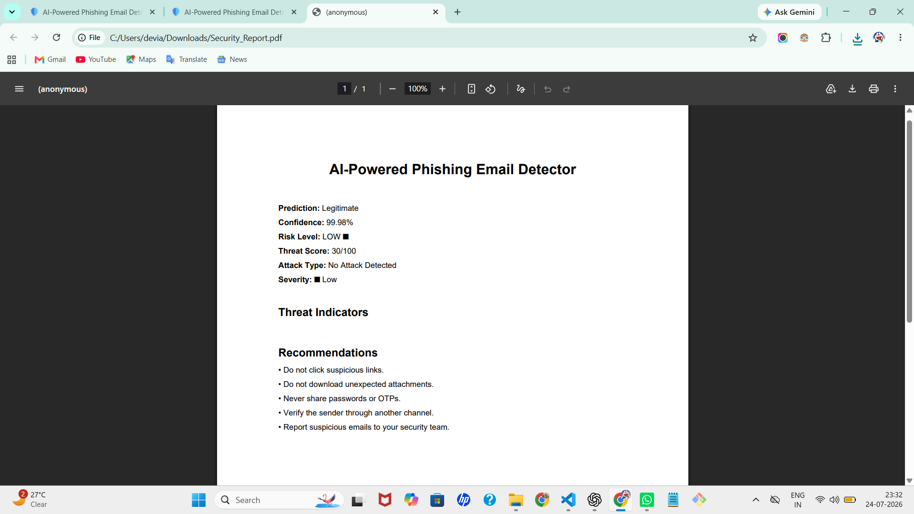

# 🛡️ AI-Powered Phishing Email Detector

An AI-based cybersecurity application that detects phishing emails using Machine Learning, Natural Language Processing (NLP), threat analysis, and risk scoring.

The system analyzes email content, identifies suspicious indicators, classifies phishing attacks, explains security risks, and provides actionable recommendations through an interactive Streamlit dashboard.

---

# 📌 Project Overview

Phishing attacks are one of the most common cybersecurity threats used by attackers to steal credentials, financial information, and sensitive data.

This project builds an intelligent email security system that automatically analyzes emails and determines whether they are:

- 🚨 Phishing Email
- ✅ Legitimate Email

Unlike traditional detection systems that only provide a prediction, this project provides:

- Risk scoring
- Threat indicators
- Attack classification
- AI-generated explanations
- Security recommendations
- Security reports

---

# 🚀 Features

## 🔍 Email Detection

- Detect phishing and legitimate emails
- Upload `.eml` email files
- Analyze pasted email content
- Automated threat identification

---

## 🤖 Artificial Intelligence & Machine Learning

- NLP-based email analysis
- TF-IDF text feature extraction
- Machine Learning classification model
- Confidence score prediction
- Automated phishing detection

---

## 🛡️ Cybersecurity Analysis

- Suspicious keyword detection
- URL identification
- Threat indicator analysis
- Risk score calculation
- Severity classification
- Phishing attack type detection

---

## 📊 Interactive Security Dashboard

- Streamlit-based interface
- Real-time email analysis
- Security analytics visualization
- Scan history tracking
- Detection statistics

---

## 📄 Security Reporting

- AI-generated explanations
- Threat summary
- Security recommendations
- PDF security report generation

---

# 🏗️ System Architecture

```
                 Email Input
                     |
                     ↓
          Email Preprocessing
                     |
                     ↓
          NLP Feature Extraction
                     |
                     ↓
          Machine Learning Model
                     |
        -----------------------------
        |             |             |
        ↓             ↓             ↓
   Risk Engine   Explanation   Attack Classifier
                     |
                     ↓
          Security Dashboard
                     |
                     ↓
        Reports & Recommendations
```

---

# ⚙️ How It Works

### 1. Email Collection

The user uploads an email file (`.eml`) or enters email content manually.

↓

### 2. Email Preprocessing

The system cleans and prepares the email text for analysis.

↓

### 3. NLP Feature Extraction

The email content is converted into numerical features using TF-IDF vectorization.

↓

### 4. Machine Learning Prediction

The trained model analyzes patterns and predicts:

- 🚨 Phishing
- ✅ Legitimate

↓

### 5. Threat Analysis

The system checks for:

- Suspicious keywords
- URLs
- Urgency indicators
- Account-related threats

↓

### 6. Risk Evaluation

A risk score and severity level are generated.

↓

### 7. Security Explanation

The system explains why the email was classified and provides recommendations.

---

# 🧰 Tech Stack

| Category | Technology |
|----------|------------|
| Programming Language | Python |
| Machine Learning | Scikit-learn |
| NLP | TF-IDF Vectorization |
| Frontend | Streamlit |
| Data Processing | Pandas |
| Visualization | Plotly |
| Model Storage | Joblib |
| Version Control | Git & GitHub |

---

# 📂 Project Structure

```
AI-Phishing-Email-Detector
│
├── src/
│   ├── app.py
│   ├── train.py
│   ├── predict.py
│   ├── analyzer.py
│   ├── risk_engine.py
│   ├── explanation_engine.py
│   └── security_report.py
│
├── models/
│   ├── phishing_model.pkl
│   └── vectorizer.pkl
│
├── data/
│
├── screenshots/
│
├── history/
│
├── requirements.txt
│
└── README.md
```

---

# 💻 Installation & Setup

## Clone Repository

```bash
git clone <your-github-repository-link>
```

## Navigate into Project

```bash
cd AI-Phishing-Email-Detector
```

## Create Virtual Environment

```bash
python -m venv .venv
```

## Activate Environment

Windows:

```bash
.venv\Scripts\activate
```

## Install Dependencies

```bash
pip install -r requirements.txt
```

---

# ▶️ Run Application

Start the Streamlit dashboard:

```bash
streamlit run src/app.py
```

Open in browser:

```
http://localhost:8501
```

---

# 📸 Screenshots

## Dashboard


---

## Phishing Detection



---

## Legitimate Email Detection



---

## Analytics Dashboard


---

## PDF Security Report



---

# 📈 Model Performance

The machine learning model achieved:

- Accuracy: 100%
- Precision: 1.00
- Recall: 1.00
- F1 Score: 1.00

---

# 🔮 Future Improvements

- Real-time email API integration
- Deep learning-based phishing detection
- Browser extension protection
- Threat intelligence API integration
- Cloud deployment
- SOC alert automation
- LLM-based cybersecurity assistant

---

# 👩‍💻 Author

**Ankita Chinchole**

Cybersecurity & Blockchain Technology Student

---

# ⭐ Project Goal

To build an intelligent cybersecurity assistant that helps users identify phishing threats and understand why an email may be dangerous.